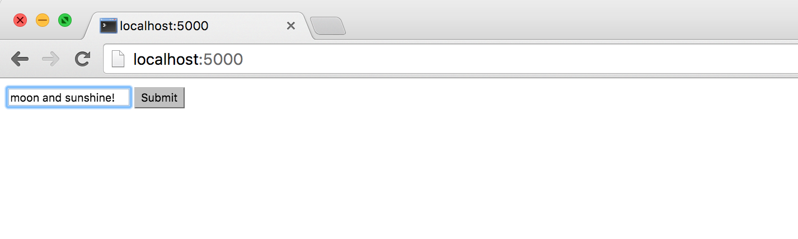

# Hello Flask App with Input and Query String

Source code for this exercise: [examples/01-hello](examples/01-hello)

This is a "Hello, World" introduction to generating query strings in your Flask web app. You'll only be learning two new things:

1. That a "webform" consists of a `<form>` tag and some `<input>` tags.
2. That the key-value pairs in a URL can be accessed by your Flask app at the view function level.

# Make app.py

Create a boilerplate Flask app that consists only of `app.py` and make sure that it runs at http://localhost:5000

By now you should be almost able to do it from memory:

~~~py
from flask import Flask
app = Flask(__name__)

@app.route("/")
def homepage():    
    return """Whats up"""

if __name__ == '__main__':
    app.run(debug=True, use_reloader=True)
~~~

OK, let's start with the part of the app that can parse the URL for the __query string__: The Flask library comes with a [__request__ object](http://flask.pocoo.org/docs/0.10/api/#flask.request), which we can expose to our app via an `import` statement. 

So change the first line to this:

~~~py
from flask import Flask, request
~~~

If your webserver and app aren't already running, get them started:

~~~sh
$ python app.py
~~~

Then visit [http://localhost:5000](http://localhost:5000) and confirm that that endpoint simply returns the text, `"Whats up"` or what have you.

## Manually write a query string

No need to write out more HTML or routing code, let's see what happens when we append a query string of our own fancy to the URL.

First of all, remind yourself of what happens when you append an arbitrary __path__ to a given URL:

        http://localhost:5000/hellomoon

Unless you've specified a `/hellomoon` route in __app.py__, visiting that URL in your browser should throw a __Not Found__ error.

Now try adding a query string. Remember that URL: query strings consist of key-value pairs. For this example, let's make the __key__, `hello` and its value, `moon`:

        hello=moon

Query strings are joined to the rest of the URL via a question mark `?`; visit the following URL in your browser:

      http://localhost:5000?hello=moon

Unlike when trying to visit an arbitrary path, e.g. `/path/to/nowhere`, the query string is basically ignored.

So now let's write some code to get that query string and deserialize it a dictionary.

## Accessing request.args

The [`flask.request` object has an attribute named `args`,](http://flask.pocoo.org/docs/0.10/api/#flask.Request.args) which is the result of parsing the current URL's query string into a dictionary. In other words, the following query string:

        hello=moon

Becomes this dictionary stored in the variable `request.args` (both key and value will be typecast as strings):

~~~py
        {'hello': 'moon'}
~~~

And to access the `hello` key of the dictionary in our Flask app, we can write:

~~~py
        request.args['hello']
~~~

But where does that snippet go? What context does the `request` object bind to? Where in `app.py` does it run?

The short answer: the `request` object only makes sense within our application's view functions. Our current __app.py__ only has a single view function, so this is easy to figure out:

~~~py
from flask import Flask, request
app = Flask(__name__)

@app.route("/")
def homepage():
    val = request.args.get('hello')
    return """Whats up, {x}""".format(x=val)

if __name__ == '__main__':
    app.run(debug=True, use_reloader=True)
~~~

Visit [http://localhost:5000?hello=moon](http://localhost:5000?hello=moon) and you should see that the output text changes with the URL query string:

          Whats up, moon

# Creating a webform

Tweaking URLs via the browser bar is not a very user-friendly feature. So let's design our simple app to have a simple input box to let the user type in and submit any text they want. Then, let __app.py__ do the work of serializing the data as a query string.

Here's the markup for a simple HTML form:

~~~html
  <form action="/whatev" method="get">
      <input type="text" name="stuff" value="">
      <input type="submit" value="Submit">
  </form>
~~~

Take a look at the attributes in the `<form>` tag:

~~~html
  <form action="/whatev" method="get">
~~~

For the subsequent examples, the `method` attribute will just be `get` -- [HTTP requests can have different methods](https://en.wikipedia.org/wiki/Hypertext_Transfer_Protocol#Request_methods), but `GET` is the most common and serves us fine.

The interesting attribute is `action`, which I've set to `/whatev` above. What does the `action` attribute signify? It basically tells the form, "When the user hits the Submit button, direct the browser to this URL".

### The `<input>` tag

The next two lines consist of `<input>` tags. The `<input>` tag can represent wildly different things based on its `type` attribute:

~~~html
      <input type="text" name="hello" value="">
      <input type="submit" value="Submit">
~~~

The first `<input>` element represents a single line text box, hence, the `type="text`. But look at the `name` and `value` attributes. The `name` attribute specifies the name of the __key__. And the `value` attribute -- which will be filled in when the user submits the form -- is the value of, well, the __value__, e.g. the `moon` to the key `hello`.

The second `<input>` element can be left as is: HTML browsers will render it as a button that is labeled `Submit` and that, when pressed, will _submit_ the form.

Throw the HTML in __app.py__ as a simple string for the `homepage()` view function to return (and delete the `request.args` part for now):

~~~py
@app.route("/")
def homepage():
    return """
      <form action="/whatev" method="get">
        <input type="text" name="hello" value="">
        <input type="submit" value="Submit">
      </form>"""
~~~

If you barely see anything, that's because there's barely any HTML to render. But there's an input box and __Submit__ button to press, so fill out the former and push the latter:

If you've followed me literally so far, pushing __Submit__ will send you to this URL, which displays a "Not Found" error:

      http://localhost:5000/whatev?hello=moon+and+sunshine%21

What's "Not Found"? Not the `'moon and sunshine'` part, but the `whatev` path -- remember what's in the `<form>` tag:

~~~html
       <form action="/whatev" method="get">
~~~

Submitting the form resulted in an "action" -- the "action" of sending us to the `/whatev` endpoint. Which doesn't exist yet. So, make it exist:

~~~py
@app.route("/whatev")
def hooray():
     val = request.args.get('hello')
     return """Whats up, {x}""".format(x=val)
~~~

Note that the route's URL pattern, `/whatev`, does not have to match the name of the view function, `hooray` -- though you probably want to reconcile them so that it's not confusing later.

Visit [http://localhost:5000/whatev?hello=moon+and+sunshine%21](http://localhost:5000/whatev?hello=moon+and+sunshine%21) again (or go back and resubmit the form), and your app should now work:

> Whats up, moon and sunshine!

Here's the complete code for __app.py__, at least for the simplified version in this walkthrough:

~~~py
from flask import Flask, request
app = Flask(__name__)

@app.route("/")
def homepage():
    return """
      <form action="/whatev" method="get">
        <input type="text" name="stuff" value="">
        <input type="submit" value="Submit">
      </form>"""

@app.route("/whatev")
def hooray():
     val = request.args.get('hello')
     return """Whats up, {x}""".format(x=val)

if __name__ == '__main__':
    app.run(debug=True, use_reloader=True)
~~~

To see a more proper app -- i.e. one that actually uses HTML templates and so forth -- you can see the source code here: [examples/01-hello](examples/01-hello)

# Conclusion

Nothing revolutionary. You learned how to make a form and a button in HTML, and then how to connect that from to your application so that a user can determine their own path through the app by sending data bits and strings via the web form. And you also learned about the[ `flask.request` object](http://flask.pocoo.org/docs/0.10/api/#flask.Request.args), which serializes the URL query string. 

The core part of what makes a Flask app -- including its routes and its views -- is still the same.
