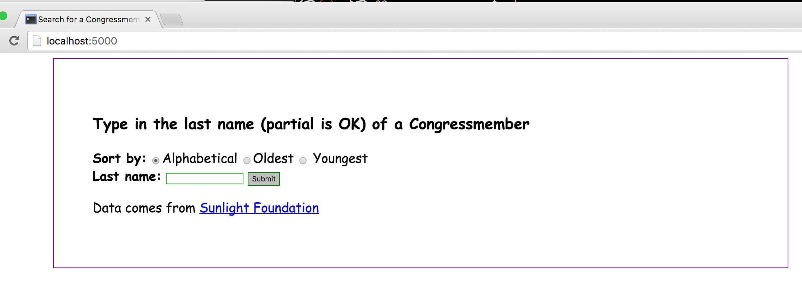
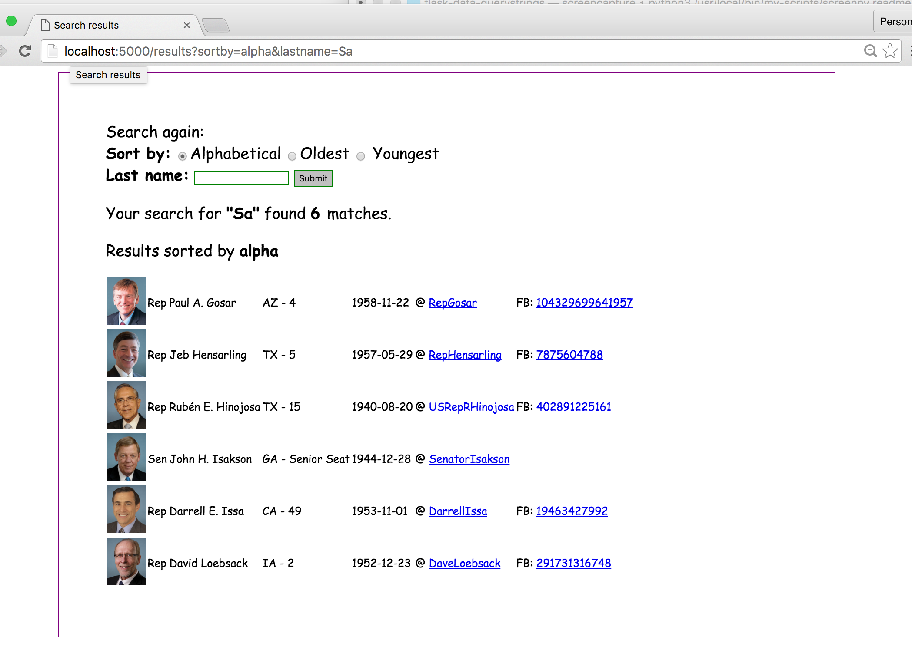

# Search Congressmembers by last name

Source code: [examples/02-congress-names](examples/02-congress-names)

The front page:

The results view:

This is slightly more complicated than the [Hello world, lesson](examples/01-hello), but not many more new concepts.

The end result of this app is to let a user search for congressmembers by last name (partial strings are OK). So, this app reads an external dataset -- the [good ol' Congressmembers spreadsheet](examples/02-congress-names/static/data/legislators.csv) and parses it, which requires more code than a simple Hello, World.

For this example, I've just crammed it all into [__app.py__](examples/02-congress-names/app.py). Note how the data reading and data filtering functions are wrapped up in _their own functions_.

Here's the function to read the data from the given filename and then to do a little wrangling -- filtering only for people who are in office, and then adding a `fullname` field:

~~~py
def get_data():
    # open data file, filter for in_office,
    # add fullname field
    # then return list of dicts
    with open('./static/data/legislators.csv', 'r') as f:
        newrows = []
        for row in csv.DictReader(f):
            if row['in_office'] == '1':
                row['fullname'] = ' '.join([row['firstname'], row['middlename'], row['lastname']])
                newrows.append(row)
        return newrows
~~~

If you were to clone the [source-code folder]((examples/02-congress-names), you could run this function without running any other part of the web app.

That is, you could open iPython, then run this code:

~~~py
from app import get_data
data = get_data()
print("There are", len(data), 'rows in the dataset.')
# There are 540 rows in the dataset.
~~~

## Sorting data

So...sorting lists and other collections is its own bag of fun. Here's a separate lesson on that:

[Sorting Python collections with the sorted method](http://www.compciv.org/guides/python/fundamentals/sorting-collections-with-sorted/)

Here's the relevant code in __app.py__:

~~~py
from operator import itemgetter

def filter_data(lastname='', sortby=None):
    # first, select only peeps that match by a name, then sort them
    lowname = lastname.lower()
    rows = [d for d in get_data() if lowname in  d['lastname']]
    if sortby == 'oldest':
        return sorted(rows, key=itemgetter('birthdate'), reverse=True)
    elif sortby == 'youngest':
        return sorted(rows, key=itemgetter('birthdate'))
    else:
        # i.e. 'alpha' or any value...just sort by last name, first name
        return sorted(rows, key=itemgetter('lastname'))
~~~

It's a little hard to see, but `filter_data()` actually calls `get_data()`. If you're new to sorting and so forth (such as, what is that `itemgetter`?), you might want to go easy.

Here's a simpler version that just filters and then sorts the data in reverse-alphabetical order:

~~~py
def filter_data(lastname=''):
    # first, select only peeps that match by a name, then sort them
    lowname = lastname.lower()
    rows = [d for d in get_data() if lowname in  d['lastname']]
    s_rows = sorted(rows, key=itemgetter('lastname'), reverse=True)
    return s_rows
~~~

Here's another way to write that, using the `lambda` construction instead of `itemgetter()`:

~~~py
def filter_data(lastname=''):
    # first, select only peeps that match by a name, then sort them
    lowname = lastname.lower()
    rows = [d for d in get_data() if lowname in  d['lastname']]
    s_rows = sorted(rows, key=lambda r: r['lastname'], reverse=True)
    return s_rows
~~~

And here's a version without using a list comprehension:

~~~py
def filter_data(lastname=''):
    # first, select only peeps that match by a name, then sort them
    lowname = lastname.lower()
    rows = []
    for d in get_data():
        if lowname in d['lastname']:
            rows.append(d)
    s_rows = sorted(rows, key=lambda r: r['lastname'], reverse=True)
    return s_rows
~~~

Basically, this is all stuff that's fundamental to Python collections -- _not_ with Flask. Re-read [examples on how to sort things in Python](http://www.compciv.org/guides/python/fundamentals/sorting-collections-with-sorted/) until they feel a little more natural to you. Adding them to a Flask app is not much of a deal in comparison.

Again, the source code for an app for this lesson can be found here: [examples/02-congress-names](examples/02-congress-names)

